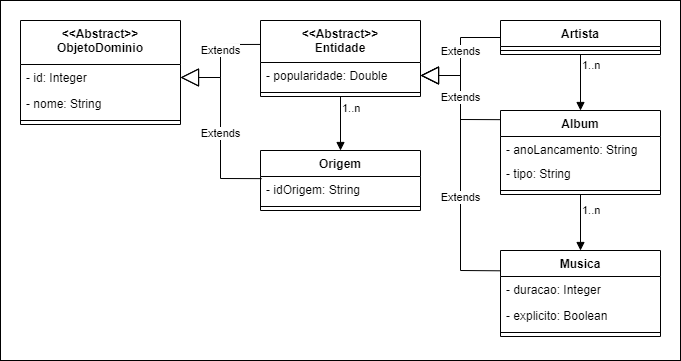

# API-Musica

Uma API inicialmente criada como trabalho final da School MJV, com o propósito de melhorar e aplicar os conhecimentos adquiridos no curso. Sua função é consumir um link ou arquivo JSON, providenciados por serviços como Spotify e Youtube Music, armazenado as informações de artistas, álbuns e musicas dentro de um banco de dados Postgres.

#### Módulos:

##### Spotify:

###### LEGENDA: ✔ Implementado | ⌚ Desenvolvimento | 📅 Planejado

- ⌚ Consumir um arquivo JSON de Playlist
- 📅 Consumir um arquivo JSON de Album
- 📅 Consumir um arquivo JSON de Artista/Banda
- 📅 Consumir um link de Playlist
- 📅 Consumir um link de Album
- 📅 Consumir um link de Artista/Banda

---

#### Dados

Segue a estrutura de dados que são armazenados pela API:

##### Artista

Possui todas as outras entidades, sua popularidade é gerada a partir de uma média da popularidade de todos álbuns que possui.

###### Consultas:

- /artistas - Todos artistas registrados;
- /artistas/{id} - Retorna artista com o id fornecido;
- /artistas/{id}/albuns - Retorna todos álbuns do artista solicitado;
- /artistas/{id}/musicas - Retorna todas músicas do artista solicitado;
- /artistas/{id}/origens - Retorna todas origens do artista solicitado;

##### Album

Possui uma coleção de musicas, sua popularidade é gerada a partir de uma média da popularidade de todas músicas que possui.

###### Consultas:

- /albuns - Todos álbuns registrados;
- /albuns/{id} - Retorna álbum com o id fornecido;
- /albuns/{id}/musicas - Retorna todas músicas do álbum solicitado;
- /albuns/{id}/origens - Retorna todas origens do álbum solicitado;

##### Musica

Responsável por fornecer popularidade, o que permiti definir o quão popular é todas as outras entidades.

###### Consultas:

- /musicas - Todas musicas registrados;
- /musicas/{id} - Retorna musica com o id fornecido;
- /musicas/{id}/origens - Retorna todas origens da musica solicitado;

##### Origem

Representa de qual plataforma originou a entidade, tem papel fundamental para evitar duplicidade de registros vindo de uma mesma plataforma.

###### Consultas:

- /origens- Todas origens registradas;
- /origens/{id} - Retorna origem com o id fornecido;

---